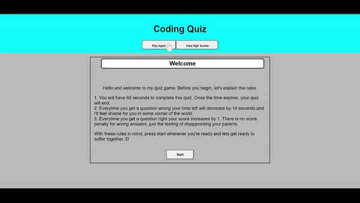

# Timed-Coding-Quiz

## Description

I created the coding quiz for a few reasons. First, I wanted a way to be able to review my coding knowledge in a fun way. Secondly, I wanted to test the ability to mix the CSS, HTML and Javascript skills I had learned so far and put them on display in one project. It was great for a first truly independt attempt at a project and I feel like I learned a lot about how to use arrays to store information and later access it, add event listeners, create buttons, style buttons in CSS, style messages in javascript, pull elements from HTML to javascript for styling, saving data inputted into the page, and most importantly to start with HTML and CSS styling before doing the Javascript. Unfortunately this project started with the javascript first and so I had a lot more limitations in styling and problems arrise than would've otherwise occured.

## Installation

To deploy this code on your own head to the repository located here https://github.com/rocas3096/Timed-Coding-Quiz. Once on the page, hit the code button and copy the repository using the https or ssh. Once complete open gitbash and head to your choosen directory where you wish to clone this code. When there, hit git clone then paste the link and the clone should copy to your local machine.

## Usage

To find this website, use this link. https://rocas3096.github.io/Timed-Coding-Quiz/

To review this repository, use this link. https://github.com/rocas3096/Timed-Coding-Quiz

## Credits

N/A

## License

N/A
